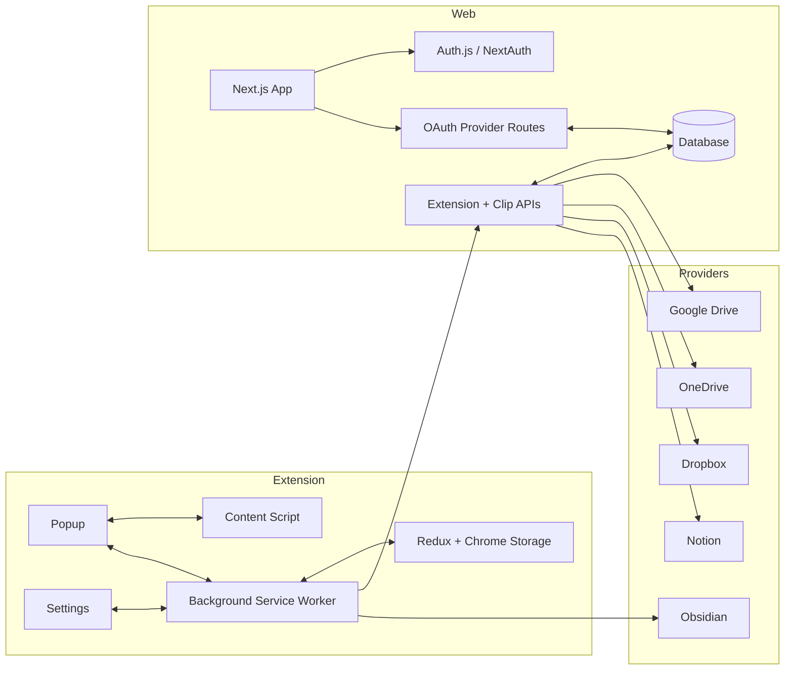
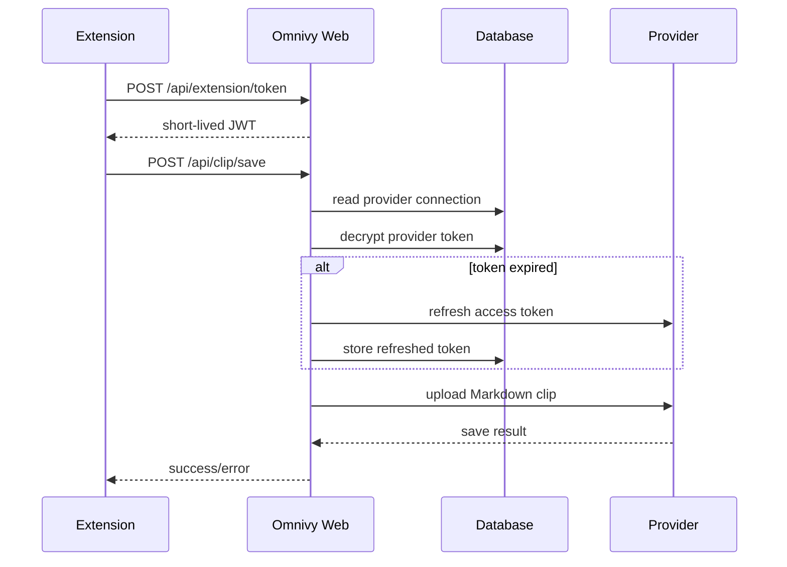

# Architecture

Omnivy is a pnpm workspace with two primary apps and shared packages.

## System Overview



## Extension

The extension is a Manifest V3 app built with Vite, React, TypeScript, Redux Toolkit, and Tailwind CSS.

Important responsibilities:

- Render the popup and settings pages.
- Track UI, behavior, vault, auth, and provider state.
- Inject or message the content script.
- Extract current-page knowledge data.
- Save Obsidian clips locally.
- Send cloud saves to Omnivy Web.
- Maintain context-menu save commands.
- Load provider connection state, folders, and destinations.

Important areas:

```text
apps/extension/src
├── pages
├── components
├── features
├── hooks
├── services
│   ├── api
│   ├── auth
│   ├── background
│   ├── content
│   ├── db
│   └── handlers
├── store
├── types
└── utils
```

## Content Pipeline

The content script handles `GET_PAGE_INFO`. It collects metadata from the page, runs the knowledge pipeline, and returns content to the popup/background.

```text
services/content/knowledge
├── pipeline.ts              # Main extraction entry
├── platformCatalog.ts       # Supported platform definitions
├── platformDetection.ts     # URL/platform matching
├── platformSelectors.ts     # Content-root selector selection
├── githubFile.ts
├── githubIssue.ts
├── stackOverflow.ts
├── forumContent.ts
├── aiConversation.ts
├── notion.ts
├── videoContent.ts
├── strategies/generic.ts
└── utils/dom.ts
```

Extraction is intentionally layered:

1. Detect known platform by URL.
2. Resolve the best content root.
3. Use a specialized extractor when one exists.
4. Fall back to generic content extraction.
5. Return Markdown, metadata, and content-scoped links.

## Web

The web app is a Next.js App Router application.

Important responsibilities:

- Serve public pages, documentation, install page, roadmap, request form, profile, and legal pages.
- Handle authentication with Auth.js/NextAuth.
- Connect providers through OAuth.
- Store encrypted provider tokens.
- Refresh provider tokens for cloud saves.
- Serve extension APIs with short-lived extension tokens.
- Manage provider folders and Notion destinations.
- Save cloud clips.
- Route feature requests and bug reports to GitHub.
- Fetch Chrome Web Store listing data for install-page stats.

Important areas:

```text
apps/web/src
├── app
│   ├── api
│   ├── install
│   ├── settings/integrations
│   ├── documentation
│   ├── request
│   └── profile
├── components
├── constants
├── context
├── hooks
├── lib
│   ├── oauth
│   ├── chromeWebStore.ts
│   ├── database.ts
│   ├── encryption.ts
│   ├── extensionAuth.ts
│   └── extensionTokens.ts
├── styles.css
└── types
```

## Cloud Save Flow



## Packages

- `packages/ui`: shared UI package.
- `packages/eslint-config`: shared ESLint configuration.
- `packages/typescript-config`: shared TypeScript configuration.

## Build Commands

```bash
pnpm build
pnpm lint
pnpm check
pnpm test
pnpm -C apps/extension build
pnpm -C apps/web build
```

## Release Notes

The extension version is declared in `apps/extension/package.json` and `apps/extension/public/manifest.json`. Keep both aligned when preparing an extension release.
