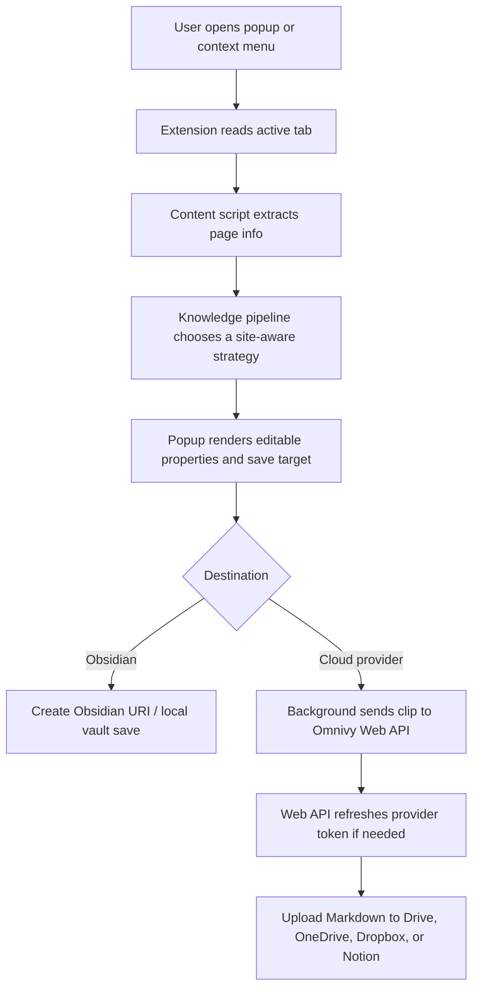
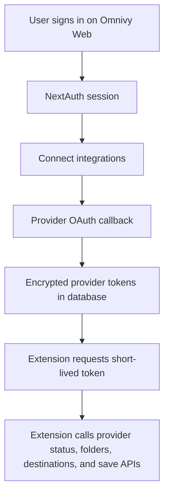

# Omnivy

Omnivy is a browser-first web clipper for saving clean Markdown from the web into Obsidian, Notion, Google Drive, OneDrive, and Dropbox.

The repository contains the Chrome extension, the Omnivy web app, and shared workspace tooling. The extension extracts page content in the browser; the web app handles sign-in, provider connections, integration settings, install information, and support flows.

## What It Does

- Clips the active browser tab into editable Markdown.
- Extracts page title, source URL, author, tags, description, links, and content.
- Uses site-aware extractors for GitHub files/issues, Stack Overflow, forums, AI conversations, Notion pages, videos, docs, articles, and generic pages.
- Lets users edit core properties and add custom frontmatter-style properties before saving.
- Saves locally to Obsidian through the browser/Obsidian URI workflow.
- Saves cloud clips through connected Google Drive, OneDrive, Dropbox, and Notion accounts.
- Loads available provider folders and Notion destinations into the extension popup.
- Supports popup saves, background auto-save behavior, context-menu saves, image stripping, and content-link capture settings.
- Uses Omnivy Web for OAuth, encrypted provider tokens, profile/session state, integration settings, documentation, install stats, reviews, and request/feedback routing.

## Repository Shape

```text
.
├── apps
│   ├── extension        # MV3 browser extension built with Vite
│   └── web              # Next.js app for auth, integrations, docs, install, support
├── packages
│   ├── eslint-config    # Shared ESLint config package
│   ├── typescript-config
│   └── ui
├── ARCHITECTURE.md
├── SUPPORTED_SITES.md
├── CONTRIBUTING.md
└── README.md
```

## Runtime Flow



## Web App Flow



## Tech Stack

### Extension

- React 19
- TypeScript
- Vite
- Redux Toolkit
- Chrome Extension Manifest V3 APIs
- Tailwind CSS v4
- Browser DOM extraction and Markdown rendering utilities

### Web

- Next.js 15 App Router
- React 19
- TypeScript
- NextAuth/Auth.js
- Prisma
- PostgreSQL-compatible database
- Tailwind CSS v4
- Motion, Three.js, Lucide icons
- Axios and Cheerio for Chrome Web Store listing stats/review parsing

### Workspace

- pnpm workspaces
- Turbo
- Shared TypeScript and ESLint config packages
- Shared UI package

## Run Locally

Install dependencies from the repository root:

```bash
pnpm install
```

Run all dev tasks:

```bash
pnpm dev
```

Build all workspaces:

```bash
pnpm build
```

Run workspace checks:

```bash
pnpm lint
pnpm check
pnpm test
```

### Extension Commands

```bash
pnpm -C apps/extension dev
pnpm -C apps/extension build
pnpm -C apps/extension lint
```

After building the extension, load `apps/extension/dist` as an unpacked extension in Chrome or another Chromium-based browser.

### Web Commands

```bash
pnpm -C apps/web dev
pnpm -C apps/web build
pnpm -C apps/web start
pnpm -C apps/web lint
```

## Environment

Use `apps/web/Example.env` as the web app template. It documents:

- `NEXTAUTH_URL`, `NEXTAUTH_SECRET`, `AUTH_SECRET`, and `NEXT_PUBLIC_SITE_URL`
- `DATABASE_URL` and `DIRECT_URL`
- `ENCRYPTION_SECRET` for provider token encryption
- Google and GitHub sign-in OAuth credentials
- OneDrive, Dropbox, and Notion provider OAuth credentials
- `EXTENSION_ALLOWED_ORIGINS`, `EXTENSION_JWT_SECRET`, token TTL values
- `GITHUB_TOKEN` and `GITHUB_REPO` for feature/bug request routing
- `CHROME_WEB_STORE_EXTENSION_ID` and `CHROME_EXTENSION_SLUG` for install-page stats

The extension reads:

```env
VITE_API_BASE_URL=http://localhost:3000
```

Point this at the local or deployed Omnivy Web app.

Never commit real `.env` secrets.

## Important Web Routes

- `/` public product page
- `/install` Chrome extension install page with listing stats and reviews fallback
- `/documentation` product and extension workflow docs
- `/settings/integrations` provider connection and destination management
- `/profile` signed-in account/session state
- `/request` feature and bug request form
- `/future-improvements` roadmap and tracked requests
- `/developer` maintainer profile
- `/privacy-policy` and `/terms-of-service`

## Important APIs

- `/api/auth/*` web session, refresh, logout, and NextAuth handlers
- `/api/extension/token` short-lived extension token issuance
- `/api/providers/status` connected provider status
- `/api/providers/folders` provider folder loading
- `/api/providers/destinations` destination listing and Notion destination management
- `/api/providers/connect/[provider]` and `/api/providers/callback/[provider]`
- `/api/providers/disconnect/[provider]`
- `/api/clip/save` cloud clip saving
- `/api/clips` clip history
- `/api/github/issues` request/feedback routing
- `/api/chrome-extension/[id]` Chrome Web Store listing stats
- `/api/chrome-extension/reviews` Chrome Web Store reviews parsing with fallback

## Supported Sources

See [SUPPORTED_SITES.md](SUPPORTED_SITES.md). The short version: Omnivy handles general webpages and has stronger extraction paths for AI chats, docs, GitHub files and issues, Stack Overflow, forum threads, Notion pages, video pages, research/reading pages, social posts, news, and product pages.

## Contributing

See [CONTRIBUTING.md](CONTRIBUTING.md) for branch, versioning, and release guidance. When changing extension behavior, web routes, provider flows, extraction logic, or environment variables, update the relevant Markdown docs in the same change.
